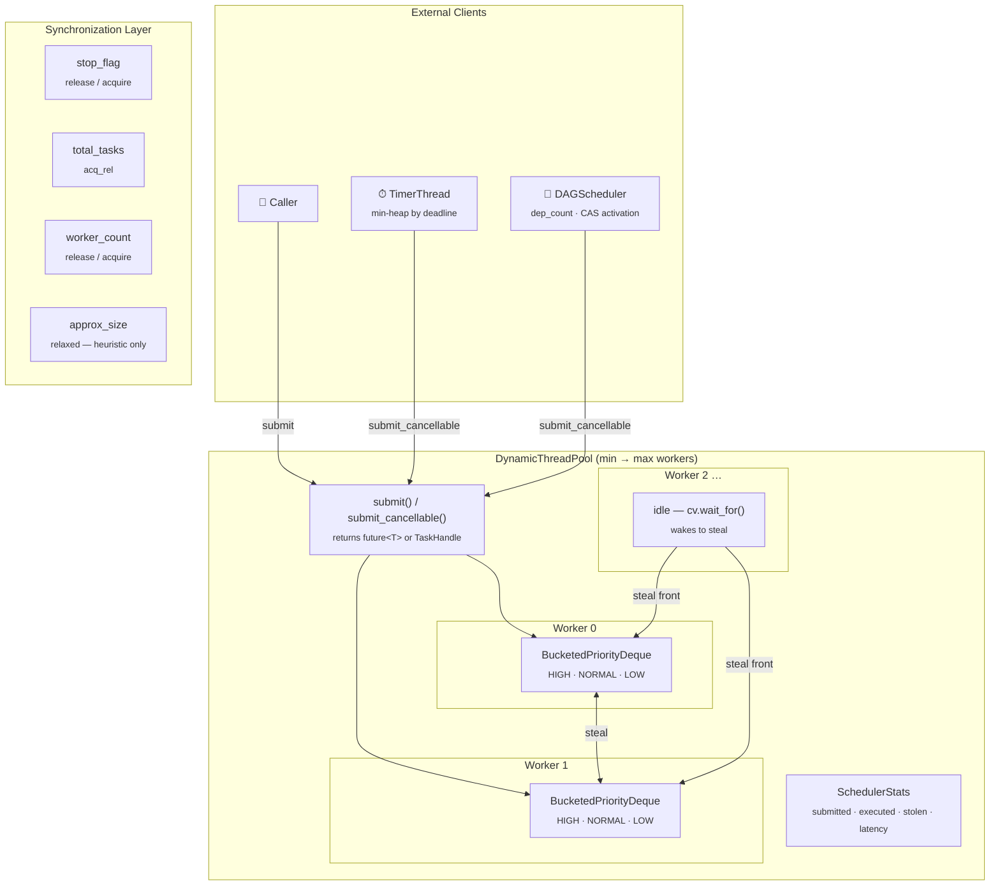

# 🧵 Thread Pool Scheduler

> A high-performance concurrent task scheduling runtime — built from scratch in C++17.


---

## Table of Contents

- [The Problem](#the-problem)
- [Architecture](#architecture)
- [Technical Concepts](#technical-concepts)
- [Benchmark Results](#benchmark-results)
- [Build & Run](#build--run)
- [What I Learned](#what-i-learned)

---

## The Problem

Most programs need to run work concurrently. The naive approach — spawn a thread per task — breaks down fast. Thread creation costs microseconds, context switching is expensive, and with thousands of tasks you're spending more time managing threads than doing actual work.

A thread pool fixes the creation cost: keep a fixed set of workers alive, hand them tasks, reuse them. But the naive pool has its own bottleneck — one global queue protected by one mutex. Every worker fights over that lock on every task. Under real load, threads spend more time waiting for the lock than running tasks.

**This project answers a more interesting question: how do you build a scheduler that actually scales?**

The solution:

| Problem | Solution |
|---|---|
| Global lock contention | Per-worker queues — no shared lock during normal execution |
| Uneven load distribution | Work stealing — idle workers take from busy ones |
| No scheduling intelligence | Priority scheduling — HIGH tasks always run before LOW |
| Fire-and-forget only | Futures + cancellation tokens — full task lifecycle control |
| Independent tasks only | DAG scheduler — tasks with dependencies, cascade cancellation |
| No delayed execution | Timer thread — schedule tasks after N milliseconds |

---

## Architecture



### How the pieces fit together

**`DynamicThreadPool`** is the core. It owns N worker threads, each with its own private task queue. Workers scale up when the queue depth grows past a threshold, and retire after sitting idle past a timeout — always keeping at least `min_workers` alive.

**`BucketedPriorityDeque`** is the per-worker queue. Three separate deques (HIGH / NORMAL / LOW) inside one lock. No sorting needed — push and pop are both O(1). Workers pop from the *back* of their highest non-empty bucket (LIFO, cache-friendly). Thieves steal from the *front* of the lowest non-empty bucket (FIFO, so old work drains first).

**`TimerThread`** maintains a min-heap of `(deadline, task)` entries. One background thread sleeps until the earliest deadline, then fires the task into the pool. Supports `schedule_after(delay)` and `schedule_at(absolute_time)`.

**`DAGScheduler`** models tasks as a directed acyclic graph. Each `TaskNode` tracks how many parents haven't finished yet (`dep_count`). When the last parent finishes, the node is activated automatically. Cancellation cascades — cancel one node and all downstream dependents are cancelled too.

---

## Technical Concepts

<details>
<summary><strong>🔀 Work Stealing</strong></summary>

<br>

When a worker's own queue is empty, it doesn't sleep immediately — it looks for work elsewhere first.

Victim selection is **busiest-first**: scan all workers' `approx_size` (a lock-free atomic, so the scan is free), pick the one with the most tasks, steal from the front of their lowest-priority bucket.

```
Owner's deque (sorted high → low priority):
  BACK: [HIGH][HIGH][NORMAL][NORMAL][LOW][LOW] :FRONT
          ↑                                ↑
     owner pops                      thief steals
   (critical work)               (leftover work)
```

This design means the owner always keeps its most important tasks locally. Only low-priority work gets redistributed. Nobody starves, and critical tasks are never interrupted.

The `approx_size` counter is deliberately approximate — it's updated *outside* the deque's mutex, so it can be stale by the time you act on it. That's fine: worst case you target a slightly-wrong victim. The actual `steal_front()` call still holds the real lock.

</details>

<details>
<summary><strong>⚡ Atomics & Memory Ordering</strong></summary>

<br>

Every stronger-than-`relaxed` memory order emits a CPU fence instruction. Fences are cheap on x86 but meaningful on ARM and POWER. The goal is to use the **weakest ordering that still gives the right guarantee**.

| Atomic | Operation | Ordering | Why |
|---|---|---|---|
| `stop_flag` | store in `shutdown()` | `release` | "releases" all queue state written before shutdown |
| `stop_flag` | load in workers | `acquire` | "acquires" that package — sees consistent queue state |
| `total_tasks` | `fetch_add` / `fetch_sub` | `acq_rel` | read-modify-write coordinating submitters ↔ workers |
| `worker_count` | store after spawn | `release` | makes the new Worker visible before anyone iterates it |
| `worker_count` | load in steal/notify | `acquire` | pairs with the spawn release |
| `approx_size` | all ops | `relaxed` | heuristic — stale reads are harmless, no ordering needed |
| `stats` counters | all ops | `relaxed` | only read at shutdown, no synchronization dependency |

**False sharing** is handled with `alignas(64)` on every hot atomic. Without it, a write to `total_tasks` from one core invalidates the cache line holding `stop_flag` on every other core — even though they're logically unrelated. Each gets its own cache line.

```cpp
// Each of these sits on its own 64-byte cache line
alignas(CACHE_LINE_SIZE) atomic<bool> stop_flag{false};
alignas(CACHE_LINE_SIZE) atomic<int>  total_tasks{0};
alignas(CACHE_LINE_SIZE) atomic<int>  worker_count{0};
```

</details>

<details>
<summary><strong>🔮 Futures & Promises</strong></summary>

<br>

`std::future<T>` is how the caller gets results back from asynchronous tasks. Internally it's a heap-allocated shared state with a mutex and a condition variable — the exact same synchronization primitive pattern used in the pool itself, just standardized.

`packaged_task<T()>` wraps any callable and fulfills the associated promise automatically when called — including capturing exceptions. This is important for task cancellation:

```cpp
auto pt = make_shared<packaged_task<void()>>(
    [fn = move(task), tok = token]() {
        tok->throw_if_cancelled();  // pre-run check
        fn();                        // actual work
    }
);
```

If the token is already cancelled, `throw_if_cancelled()` throws `CancellationException`. `packaged_task` catches it and stores it in the promise. The future holds the exception — **no broken promises**, even for cancelled tasks.

The `shared_ptr<packaged_task>` in the queue lambda is what keeps the task alive until a worker calls it. When the Task object is destroyed (e.g. during shutdown drain), the lambda is destroyed, the `shared_ptr` refcount drops, and the `packaged_task` is cleaned up. Ownership is automatic.

</details>

<details>
<summary><strong>🔔 Condition Variables</strong></summary>

<br>

Each worker has its own `condition_variable` and a dedicated mutex (`cv_m`) — separate from the deque's own internal mutex. This separation matters:

- **Deque mutex**: protects task data (push/pop/steal)
- **CV mutex**: protects the sleep/wake state

`cv.wait()` releases the CV mutex while sleeping, then re-acquires it on wake. If the CV mutex were the same as the deque mutex, the deque would be locked while the worker slept — nobody could push tasks in.

The sleep predicate is the "wakeup gate":

```cpp
bool got_work = me.cv.wait_for(lock, idle_timeout, [&] {
    return stop_flag.load(acquire)         // shutdown — time to exit
        || !me.deque.empty()               // direct work arrived
        || total_tasks.load(acquire) > 0;  // something to steal
});
```

`wait_for` instead of `wait` enables **idle timeout for dynamic scaling**: if no work arrives within `idle_timeout_sec`, the worker considers retiring (if active count is above the minimum).

The `is_idle` flag is set *inside the CV lock* before entering `wait`. This prevents a subtle race: without it, `submit()` could see `is_idle = false`, skip sending a notification, and the worker could then enter `wait` just after — sleeping forever with a task in its queue.

</details>

<details>
<summary><strong>🔗 DAG Scheduling</strong></summary>

<br>

The `DAGScheduler` lets tasks declare dependencies on each other. A task only runs when all its dependencies have finished.

```
A → B → D
A → C → D
```

Here D can't start until both B and C are done. B and C can't start until A is done. A has no dependencies, so it runs immediately.

Each `TaskNode` has an atomic `dep_count` — the number of unfinished parents. When a parent finishes, it decrements the count:

```cpp
int old = dependent->dep_count.fetch_sub(1, acq_rel);
if (old == 1) {
    // fetch_sub returns the OLD value.
    // Only ONE thread can ever see old == 1 for a given node.
    // This is the thread that caused dep_count to reach zero.
    // Exactly one activation. No double-submission possible.
    activate(dependent);
}
```

**Cascade cancellation**: when a node is cancelled, all its descendants are cancelled too. The cascade decrements `dep_count` for each downstream node, fulfills their futures with `CancellationException` directly (without submitting to the pool), and recurses. The `pending_tasks` counter still reaches zero, so `wait_all()` unblocks cleanly.

</details>

<details>
<summary><strong>🚫 Task Cancellation</strong></summary>

<br>

Cancellation is cooperative. The submitter and task share a `CancellationToken` — a `shared_ptr` to an atomic bool.

```cpp
auto token = make_token();

auto handle = pool.submit_cancellable([token]() {
    for (int i = 0; i < 1'000'000; i++) {
        do_work(i);
        token->throw_if_cancelled();  // cooperative checkpoint
    }
}, Priority::NORMAL, token);

// Somewhere else:
handle.cancel();   // sets the atomic bool
handle.wait();     // blocks until the task acknowledges
```

Three cancellation scenarios:

| When | What happens |
|---|---|
| **Before run** (task still in queue) | Pre-run check at top of packaged_task fires. `CancellationException` stored in future. Task body never executes. |
| **Mid-run** (task is executing) | Next call to `throw_if_cancelled()` inside the loop throws. Exception propagates out of the task body, captured by `packaged_task`. |
| **After done** | `cancel()` sets the flag. `is_done()` returns true. Nothing else happens — too late. |

In every case the future is fulfilled (either with a value or with `CancellationException`), so `handle.wait()` always returns.

</details>

---

## Benchmark Results

> Measured on a **single-core VM** (1 hardware thread). On single-core, adding workers increases overhead — the numbers show scheduling coordination cost and correctness, not parallel speedup. On an 8-core machine, throughput would scale near-linearly to core count.

### Throughput — 200,000 tasks, no payload

| Workers | Time | Tasks/sec | Steal % | Avg latency |
|:-------:|-----:|----------:|--------:|------------:|
| 1 | 178 ms | 1,123,595 | 0.0% | 3,446 µs |
| 2 | 260 ms | 769,230 | 29.8% | 2,098 µs |
| 4 | 375 ms | 533,333 | 46.9% | 1,536 µs |
| 8 | 484 ms | 413,223 | 43.7% | 1,536 µs |

The steal percentage climbing as workers increase is the meaningful signal — the scheduler actively redistributes work rather than letting workers idle.

### Latency Percentiles — 4 workers, 10,000 tasks

```
p50   ████████░░░░░░░░░░░░  1,924 µs
p90   ██████████████░░░░░░  3,394 µs
p99   ████████████████░░░░  4,227 µs
p99.9 ████████████████░░░░  4,260 µs  ← flat tail, no outliers
min   ░░░░░░░░░░░░░░░░░░░░      4 µs  ← fast path when worker is idle
max   ████████████████████  8,875 µs
```

p99 and p99.9 are nearly identical — no runaway tail. The 4 µs minimum is the fast path: task goes from `submit()` to executing in nanoseconds when a worker is already waiting.

### Steal Rate by Load Pattern — 4 workers, 20,000 tasks

```
Balanced   (round-robin)  ████████████████████████  56.5%  23 ms
Imbalanced (all to W0)    ████████████████░░░░░░░░  36.2%  18 ms
```

On single-core, balanced distribution steals *more* — tasks spread across deques, so whichever thread wins the CPU must reach across to drain others. On multi-core these numbers flip: balanced → near 0%, imbalanced → >50%.

### Priority Ordering — 1 worker, 60 tasks

> 20 LOW submitted first, then 20 HIGH, then 20 NORMAL.
> HIGH should run before NORMAL, NORMAL before LOW — regardless of submission order.

```
HIGH tasks in first 20 execution slots: 20/20  ✅ perfect
```

The `BucketedPriorityDeque` pops bucket[HIGH] first, then bucket[NORMAL], then bucket[LOW] — O(1) priority ordering, no sorting.

### Correctness

| Test | Result |
|---|---|
| No lost tasks — 50k submitted = 50k executed | ✅ |
| DAG diamond — node D runs exactly once | ✅ |
| Cancel before run — task skipped in queue | ✅ |
| Cancel mid-run — stops at cooperative checkpoint | ✅ |
| Cancellation cascade — C cancelled → D = CANCELLED | ✅ |
| Timer precision — fires at 100ms / 250ms / 400ms | ✅ |
| Clean shutdown — RAII destructor drains all tasks | ✅ |
| Cancelled tasks — promise always fulfilled (no broken future) | ✅ |

---

## Build & Run

No dependencies beyond the C++ standard library.

```bash
# compile
g++ -std=c++17 -pthread -O2 threadPool.cpp -o threadPool

# run all tests and benchmarks
./threadPool
```

**Expected output:**

```
[ThreadPool] min=4 max=8 idle_timeout=30s
✅ No lost tasks: 50000 == 50000
  Time: 135ms  (370370 tasks/sec)
...
✅ All tests complete
```

---

## What I Learned

The gap between "working" and "correct" is surprisingly large in concurrent code. A few things that took real effort to get right:

**The shutdown deadlock trap.**
Early versions held `workers_m` while calling `join()`. Workers themselves acquire `workers_m` inside `try_steal()` — instant deadlock. The fix: snapshot the worker count, release the lock, *then* join. Safe because once `stop_flag = true`, no new workers can be added.

**Memory ordering is not just `seq_cst` everywhere.**
Using the strongest ordering by default works but wastes CPU fences. Going through each atomic and asking *"what guarantee do I actually need here?"* — and being able to explain it in a comment — turned out to be a useful discipline. On ARM the difference between `relaxed` and `seq_cst` on a hot counter is measurable.

**False sharing is invisible until it isn't.**
Four atomics packed into the same cache line means a write to `total_tasks` from one core invalidates the cache line holding `stop_flag` on every other core — even though they're logically unrelated. `alignas(64)` on each hot atomic makes them independent. The performance difference under contention is real.

**The `fetch_sub` pattern for exactly-once activation.**
The fact that `fetch_sub` returns the *old* value is not a convenience — it's what makes exactly-once DAG node activation possible without any additional locks. Only one thread ever sees `old == 1`. Understanding why this works requires thinking carefully about what "atomic" means at the CPU level.

**Cooperative cancellation is the right model.**
Force-killing a running thread in C++ is undefined behavior. Cooperative cancellation — the task voluntarily checks a flag — is the correct approach. The key insight is that the `packaged_task` always captures the `CancellationException`, so the future is always fulfilled. No matter what happens to a task (runs, cancelled early, cancelled mid-run), the caller's `future.get()` always returns.
